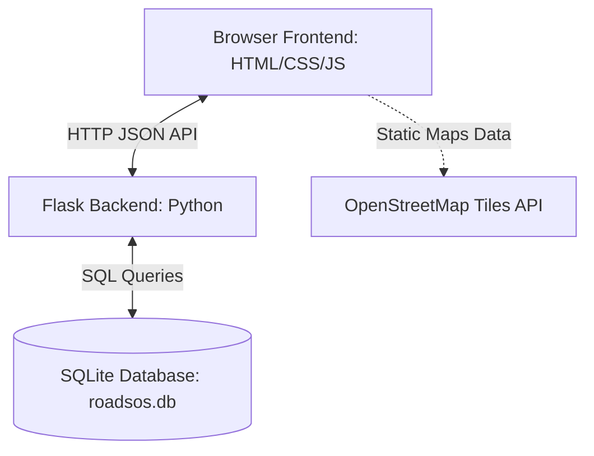
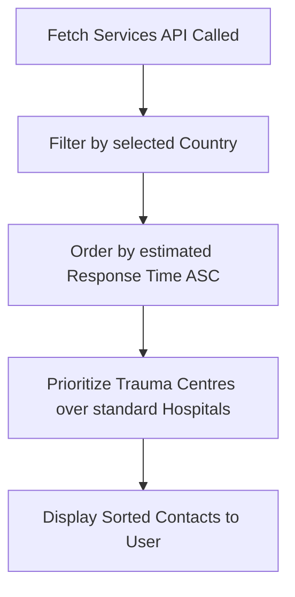
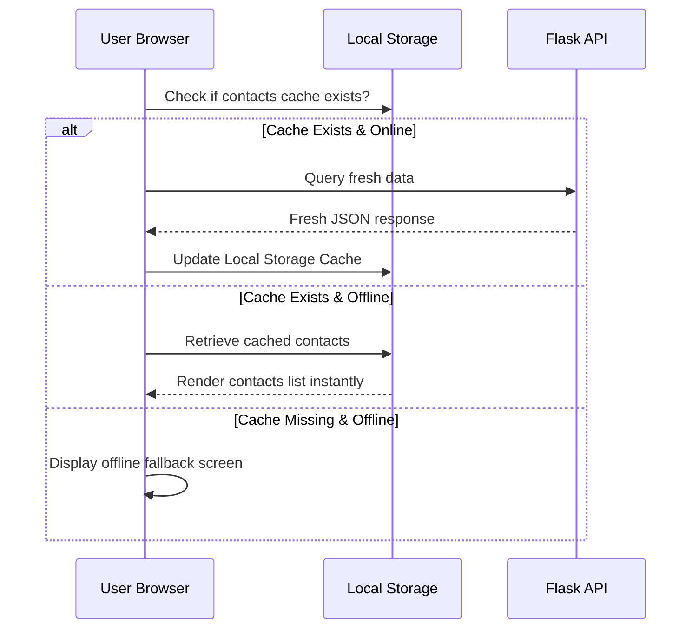

# System Architecture & Workflows - RoadSoS

This document provides a detailed breakdown of the system components, database schemas, and workflows that drive the RoadSoS application.

---

## 1. System Overview

RoadSoS uses a lightweight client-server model designed for speed, portability, and low data consumption. 



### Components:
1. **Frontend Client:** Built using vanilla HTML5, CSS3, and modern JavaScript. It uses **Leaflet.js** to render offline-capable maps using OpenStreetMap tiles. It features local caching via the browser's `localStorage` API.
2. **Web Server:** A **Flask** web application written in Python, served in production using **Gunicorn**. It exposes static routes and REST API endpoints.
3. **Database:** An **SQLite** relational database file (`roadsos.db`) containing categorized directories of emergency and recovery contacts.

---

## 2. Database Schema

All database tables share a unified relational structure, which ensures that services can be query-mapped and filtered dynamically.

### Emergency & Support Services Tables
The database maintains separate tables for each category (e.g., `trauma_centres`, `hospitals`, `police_stations`):

| Column | Data Type | Description |
| :--- | :--- | :--- |
| `id` | INTEGER (PK) | Auto-incrementing unique identifier. |
| `country` | TEXT | ISO country code (e.g., `IN`, `US`, `GB`). |
| `city` | TEXT | Local city or area name. |
| `name` | TEXT | Service name (e.g., "AIIMS Trauma Centre"). |
| `latitude` | REAL | Coordinate latitude. |
| `longitude` | REAL | Coordinate longitude. |
| `contact` | TEXT | Telephone or emergency hotline number. |
| `service_area` | TEXT | Coverage boundary note. |
| `verified_on` | TEXT | ISO verification date (e.g., `2026-05-01`). |
| `response_minutes`| INTEGER | Expected response time in minutes. |
| `source_note` | TEXT | Source or reliability verification note. |

---

## 3. Core Workflows

### 3.1. Rescue Priority Score Logic
When services are queried, the platform orders and filters contacts based on urgency rather than simple alphabetical sorting:



* **Urgency Weighting:** The backend returns services categorized by their relative severity. The map list ranks items dynamically so that trauma-level support is always positioned at the top of the user's list.

### 3.2. Offline Low-Network Caching Flow
To support rural highways and weak connectivity areas:



---

## 4. REST API Documentation

### 4.1. Get Services Directory
* **Endpoint:** `/api/services`
* **Method:** `GET`
* **Query Parameters:** `country` (e.g., `IN`, `US`, `GB`, `ALL`)
* **Response Example:**
  ```json
  {
    "trauma_centres": [
      {
        "id": 1,
        "country": "IN",
        "city": "New Delhi",
        "name": "AIIMS Trauma Centre",
        "latitude": 28.5672,
        "longitude": 77.21,
        "contact": "+91 11 2659 4444",
        "service_area": "South Delhi",
        "verified_on": "2026-05-01",
        "response_minutes": 9,
        "source_note": "Sample public trauma centre entry"
      }
    ]
  }
  ```

### 4.2. Get Metadata Configurations
* **Endpoint:** `/api/meta`
* **Method:** `GET`
* **Response:** Returns list of supported countries, their map center coordinates, national emergency hotlines, and category display labels.
